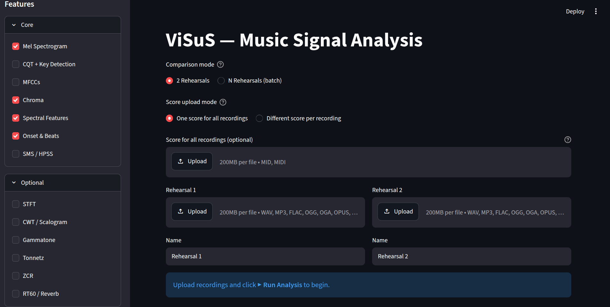
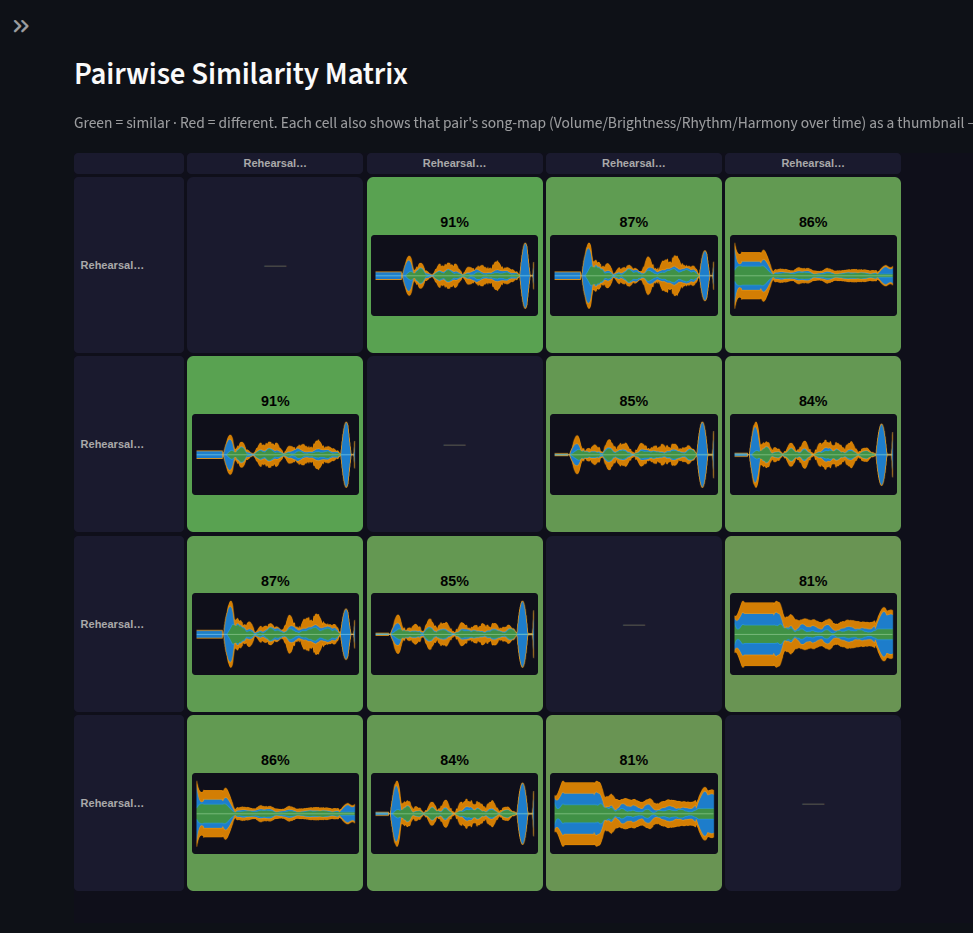
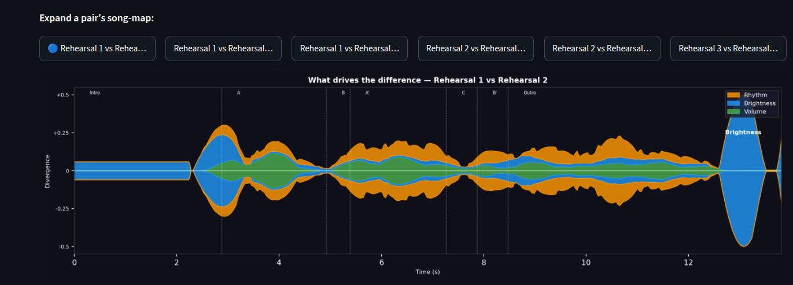
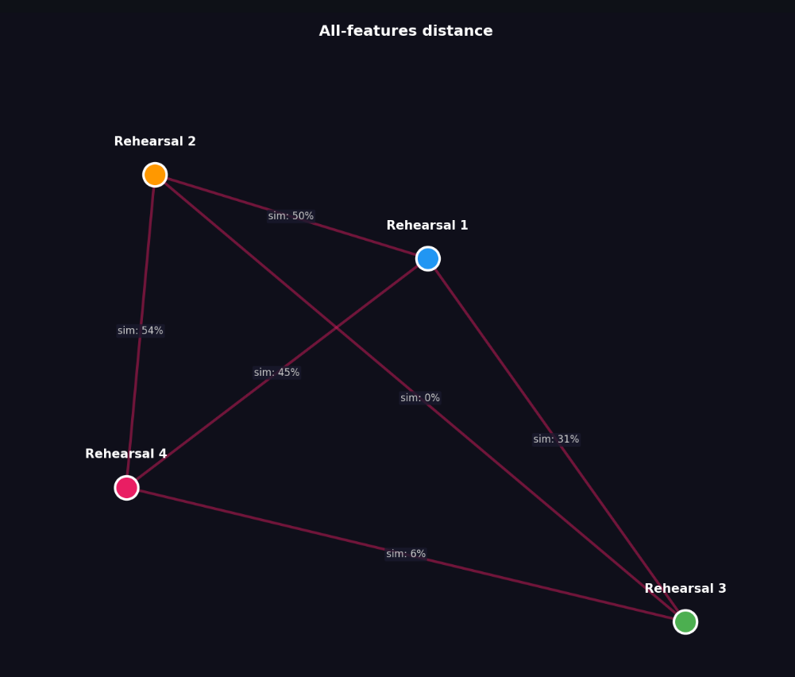
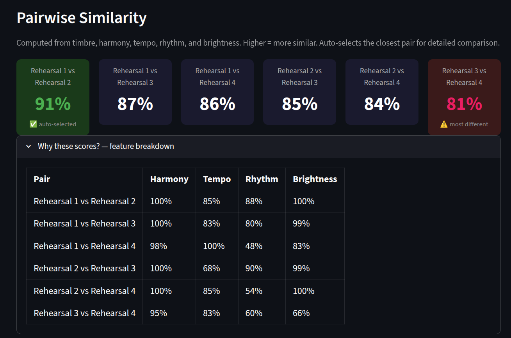
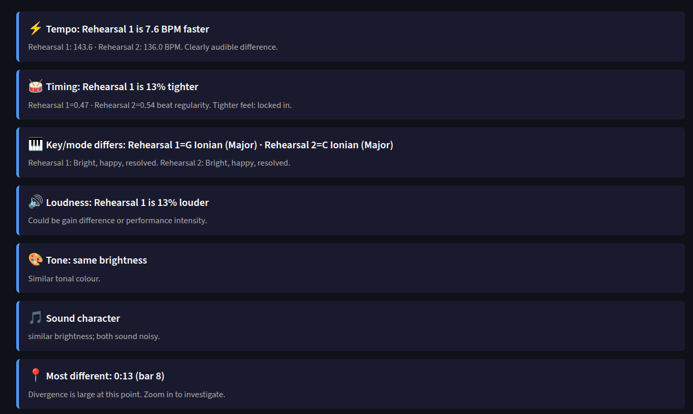

# ViSuS - Music Rehearsal Recording Comparison Tool

ViSuS analyzes and compares multiple recordings of the same piece - different
takes of one rehearsal, or the same song played in different sessions/styles -
using real audio feature extraction (not just waveform diffing), DTW
alignment, and similarity scoring. Built as HIWI research work at VISUS
(Visualisierungsinstitut, Universität Stuttgart), under Simeon's supervision.

> Drop your PNGs into a `screenshots/` folder at the repo root using the
> filenames referenced below, and they'll render here automatically on
> GitHub once pushed.

> **New here?** [`WALKTHROUGH.md`](WALKTHROUGH.md) is the full narrated,
> screenshot-by-screenshot tour - upload through every visualization, in the
> order you'd actually click through them, with all 34 screenshots embedded.
> This README covers architecture and setup with a handful of highlights;
> WALKTHROUGH.md covers everything the app does and shows, image by image.

---

## What it does

Upload 2 or more recordings of the same piece. ViSuS extracts audio features
per recording (tempo, key, mode, timbre, harmony, rhythm, dynamics - the
specific set depends on which persona you're using, see below), aligns pairs
with DTW, and produces:

- A **similarity score** per pair (0–100%), broken down by feature category
- A **stream graph** showing *what's driving* the difference between two
  recordings over time (Volume / Brightness / Rhythm / Harmony)
- A **Recording Map (MDS)** placing all recordings in 2D space by overall
  distance, for N ≥ 3 recordings
- A **Group View** comparing raw per-feature values across all recordings at
  once (not divergence - actual values, so you can see e.g. "Take 3 is
  consistently louder")
- Per-section breakdowns (detected structural sections, compared in
  isolation, with neutral same/slight/notable difference flagging - never
  "better/worse")

---

## Architecture

```
┌─────────────────────────┐        ┌──────────────────────────┐
│   Full client frontend   │        │    ESM client frontend    │
│   (app_full_client.py)   │        │    (app_esm_client.py)    │
└────────────┬──────────────┘        └─────────────┬──────────────┘
             │                                      │
             └──────────────┬───────────────────────┘
                             │  HTTP (JSON + numpy arrays)
                     ┌───────▼────────┐
                     │  api_client.py  │   <- the ONLY file either
                     └───────┬────────┘      frontend uses to talk
                             │                to the backend
                             │
                     ┌───────▼────────┐
                     │  FastAPI backend │
                     │  (main.py)       │
                     │  compute.py      │  <- all audio analysis
                     │  verdict.py      │  <- same/slight/notable logic
                     └──────────────────┘
```

The backend does **all** compute - librosa feature extraction, DTW alignment,
MDS, similarity scoring. Both Streamlit apps are thin clients: they call
`api_client.py`, get back JSON (numpy arrays included), and draw charts with
matplotlib. Neither frontend touches audio files directly once uploaded.

This split exists so the same backend can serve multiple frontend personas
(currently two, more possible later - e.g. a future mobile client) without
duplicating any analysis code.

**Locked design decision:** the backend returns raw arrays, not pre-rendered
images - drawing stays entirely on the client side, keeping the backend a
pure compute service.

---

## Two frontend personas

ViSuS ships two separate Streamlit apps against the same backend, for two
different audiences.

### 1. Full client (`app_full_client.py`)

The detailed, desktop-oriented persona - for Rustom/Simeon-level analysis
work: full scientific numbers, every plot, every feature tab.

**What it shows:**
- Pairwise Similarity Matrix - a color-coded grid (green = similar, red =
  different) for all pairs at once when comparing 3+ recordings, with each
  cell showing an embedded stream-graph thumbnail; clicking a pair below the
  grid expands its full-size stream graph, using data already fetched (no
  extra backend round-trip on click)
- Recording Map (MDS) - 2D distance plot across all recordings, with
  adjustable feature-group weights
- Group View - raw feature values (not divergence) across all recordings
  over time
- Spectrograms, harmony/rhythm/dynamics/spectral tabs, DTW alignment view,
  score alignment against an optional uploaded MIDI reference - full
  feature depth, all sidebar-toggleable

<table>
  <tr>
    <td align="center">
      <br>
      <sub>Sidebar: upload, score mode, feature toggles</sub>
    </td>
    <td align="center">
      <br>
      <sub>Pairwise Similarity Matrix with thumbnails</sub>
    </td>
  </tr>
  <tr>
    <td align="center">
      <br>
      <sub>Expanded stream graph for one pair</sub>
    </td>
    <td align="center">
      <br>
      <sub>Recording Map (MDS)</sub>
    </td>
  </tr>
</table>

See [`WALKTHROUGH.md`](WALKTHROUGH.md) for the full set - Group View,
Alignment, Harmony, Rhythm, Dynamics, Spectral, Spectrograms, and Score
Alignment, all with real screenshots.

**Feature flags sent per upload** (`FEATURE_FLAGS` in `app_full_client.py`):
mel spectrogram, chroma, spectral features, onset - on by default; CQT,
MFCC, SMS/HPSS, STFT, CWT, gammatone, Tonnetz, ZCR, reverb - off by default,
toggleable in the sidebar.

### 2. ESM client - "Everybody Speaks Music" (`app_esm_client.py`)

The simplified, non-technical persona - built for an external band/group who
want plain-language verdicts, not spectrograms or scientific numbers.

**What it shows:**
- Percentage similarity per pair, tap-to-expand plain-language explanations
- Key, mode, and tempo - no raw plots
- Same same/slight/notable verdict language as the Full client, but no
  underlying charts exposed
- Supports up to 8 takes at once

<table>
  <tr>
    <td align="center">
      <br>
      <sub>ESM overview - percentages and verdicts</sub>
    </td>
    <td align="center">
      <br>
      <sub>Tap-to-expand plain-language explanation</sub>
    </td>
  </tr>
</table>

**Feature flags sent per upload** (`ESM_FEATURE_FLAGS`): MFCC, chroma,
spectral, onset, SMS on - mel, CQT, STFT, CWT, gammatone, Tonnetz, ZCR,
reverb off. Deliberately lighter than the Full client's defaults, since ESM
never renders spectrograms or advanced plots that would need the heavier
features.

### Why two separate apps instead of one with a mode toggle

Kept as fully separate Streamlit entrypoints (not a single app with an
`if persona == "esm"` branch) so each persona's UI stays simple to reason
about and neither accumulates dead code paths for the other's features. Both
call the same backend, so there's no logic duplication where it actually
matters (the analysis itself).

---

## Running locally

Three processes, three terminals, from the repo root:

```bash
# 1. Backend
cd backend
source visus_venv/bin/activate
python -m uvicorn main:app --host 0.0.0.0 --port 8000

# 2. Full client
cd frontend
BACKEND_URL=http://localhost:8000 streamlit run app_full_client.py --server.port 8501

# 3. ESM client
cd frontend
BACKEND_URL=http://localhost:8000 streamlit run app_esm_client.py --server.port 8502
```

Open `localhost:8501` for the Full client, `localhost:8502` for ESM.

---

## Hosting status

| Host | Status |
|---|---|
| Render (backend, Docker) | Live, but has an undocumented proxy request timeout on slow synchronous requests - mitigated once by trimming default feature flags, but heavier features (like the restored eager thumbnail matrix) can retrigger it |
| phoenix / IMS server + ngrok | Confirmed working end-to-end (backend + both Streamlit Cloud frontends), but ngrok's free tier gives a non-persistent URL - validation rig, not a stable host |
| Oracle Cloud Always Free | In progress - permanent free VM (up to 4 OCPU/24GB ARM Ampere), chosen specifically because it has no proxy timeout ceiling, unlike Render |

No permanent public deployment is live right now. Backend + both frontends
run correctly split apart locally - the deployment step (not the
architecture) is what's outstanding.

---

## Known limitations

- **Large uploads (>100MB) can hang the frontend.** `api_client.py` doesn't
  currently catch `requests.exceptions.Timeout` separately from
  `ConnectionError`, so a very slow request crashes the Streamlit script run
  uncaught rather than failing gracefully. Not yet fixed - deferred.
- **No async processing.** Uploads and comparisons are synchronous
  request/response; a real fix for large files would be an async job-id +
  polling pattern, not just a longer timeout.
- Eager pairwise thumbnail computation in the Full client's matrix view scales
  as N×(N−1)/2 backend calls - fine for small N, a real cost on a
  timeout-constrained host for larger N.
