# ESM Walkthrough - What a Band Member Actually Sees

This is the ESM persona's narrated tour, screenshot by screenshot: a
verdict card, a stream graph, a section-by-section breakdown, and four
dimension cards, all in plain language - built for a university band that
wants a fast, honest answer about a rehearsal take, not a research tool.

If you haven't read it yet, [`ESM_README.md`](ESM_README.md) explains who
ESM is and why this persona exists as its own app. This document is the
visual walk-through of it in use.

All screenshots below live in `screenshots/esm-client/` at the repo root.

---

## 1. Uploading takes

ESM accepts audio uploads and computes the same underlying analysis as the
Full client - the difference starts entirely at what gets shown back, not
what gets computed. Up to 8 takes can be compared in a single batch.

  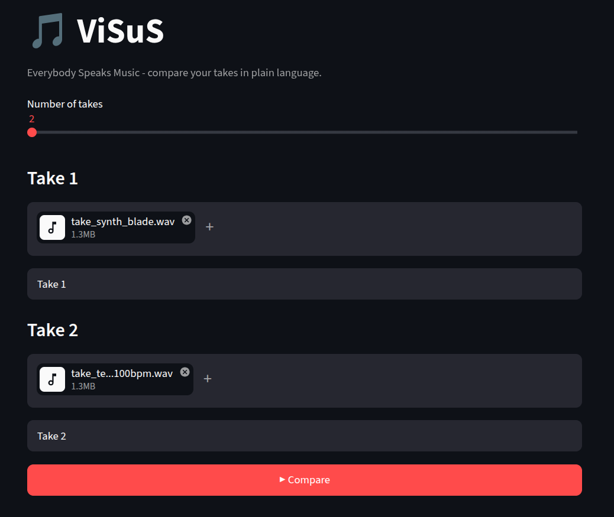

*ESM's upload screen: take-selection slider and a file input per take.*

## 2. The headline result

Once two takes are compared, ESM leads with a single plain-language verdict
("Mostly matched") plus audio playback and a key/tempo overview per take -
no numbers-first framing.

  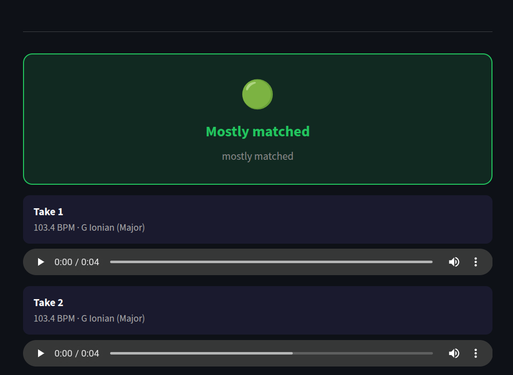

*Overall match indicator with embedded audio playback and key/tempo per take.*

## 3. What stands out

Below the verdict, a set of summary cards calls out the specific things a
musician would actually ask about - Tempo, Timing, Key/Mode, Loudness,
Tone, Texture, and Sound Character - each in words, not just a score.

  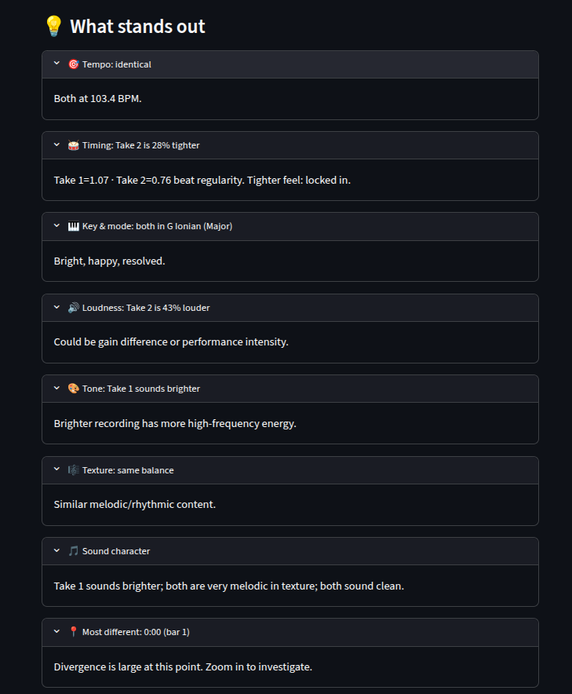

*Plain-language comparison cards, one per feature area.*

## 4. Where they diverge

A simplified stream graph shows which features drove the difference between
the two takes over time - Volume, Brightness, Rhythm, Harmony - with a
legend explaining how to read it.

  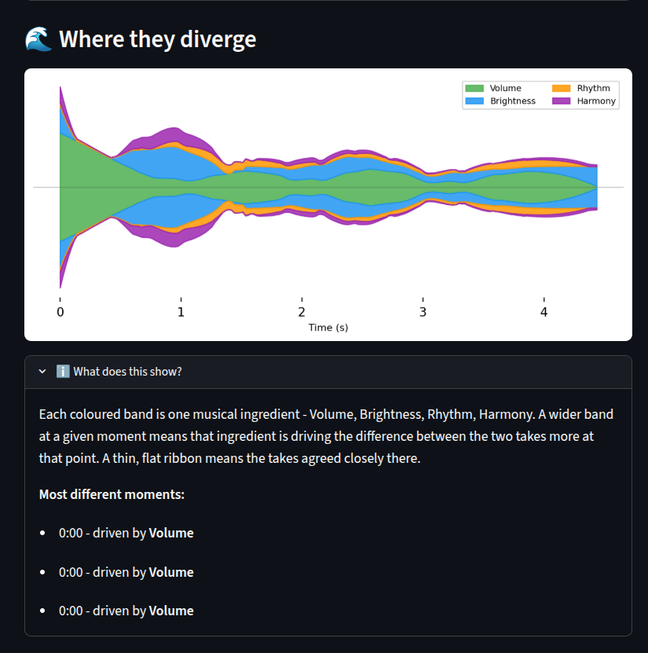

*Stream graph of feature divergence over time, with explanatory legend.*

## 5. Section by section

ViSuS detects structural sections in the piece (Intro, A, B, A', C, B',
Outro) and gives each one its own card, flagging neutral same/slight/notable
differences per section - never "better" or "worse."

  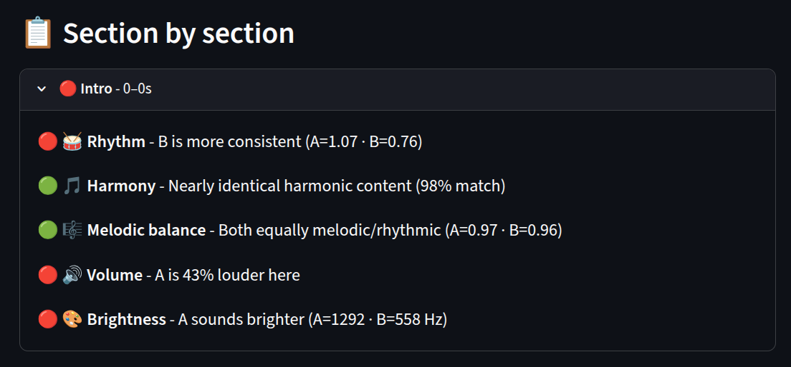

*Intro section: neutral feature-difference flags for Rhythm, Harmony,
Volume, Brightness.*

  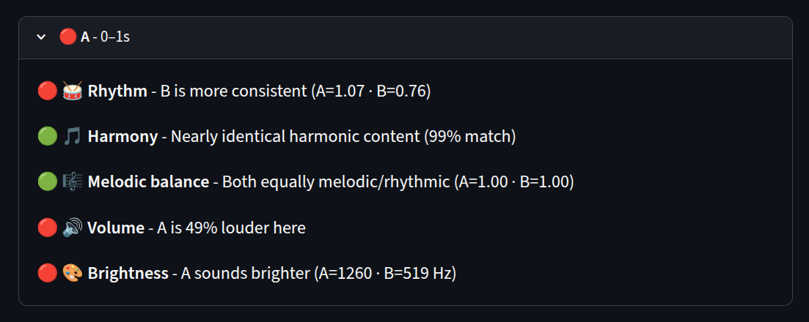

*Section A.*

  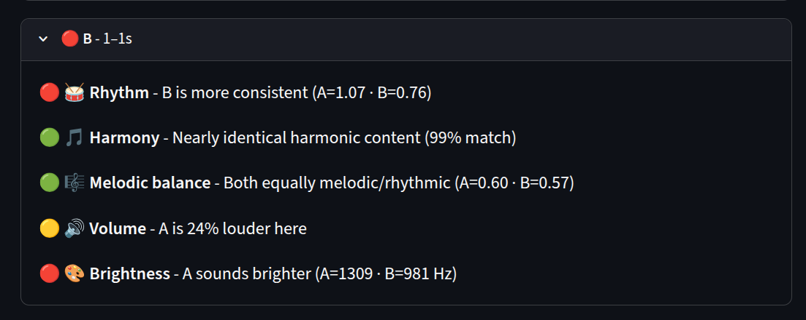

*Section B, highlighting loudness and brightness variance.*

  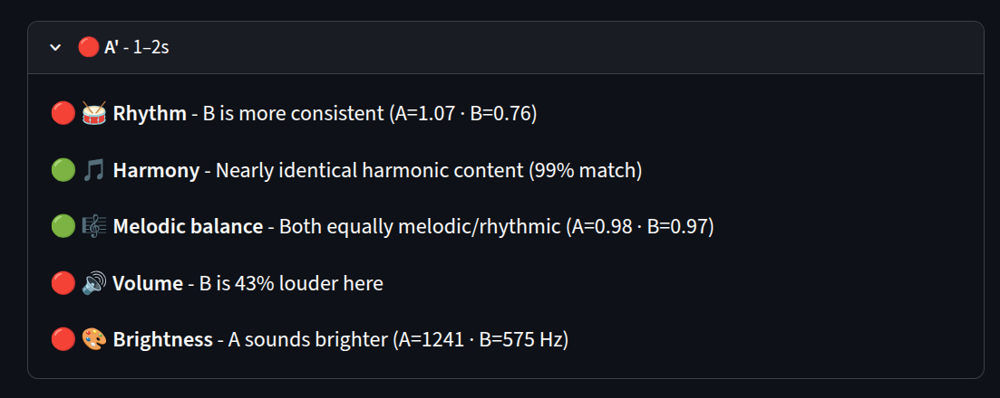

*Section A', detailing consistency and volume differences.*

  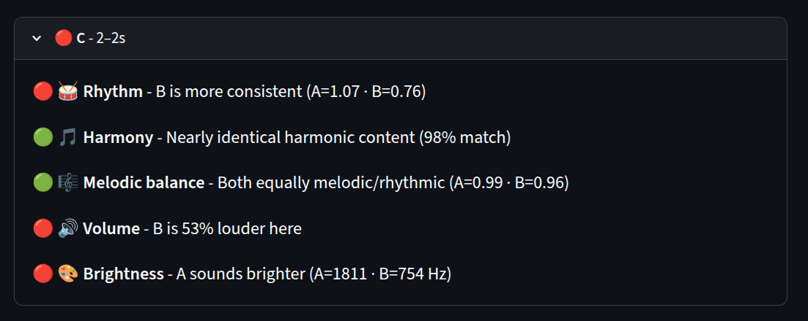

*Section C, with harmonic and acoustic energy comparisons.*

  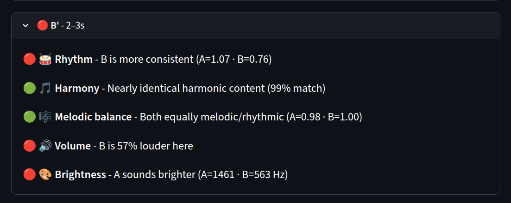

*Section B', evaluating relative volume gain and tonal brightness.*

  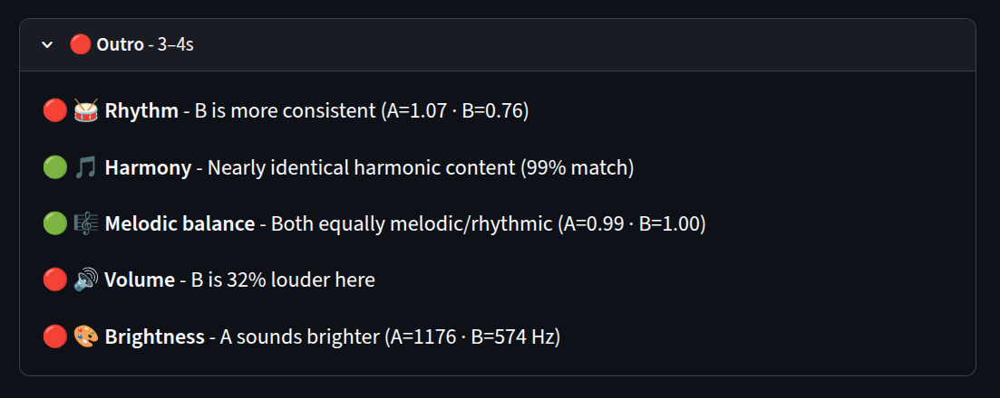

*Outro, detailing relative volume, rhythm, and brightness differences.*

## 6. Harmony

Each dimension gets its own card: a percentage badge plus a simplified
chart - never a full spectrogram or chromagram, but not just a bare number
either.

  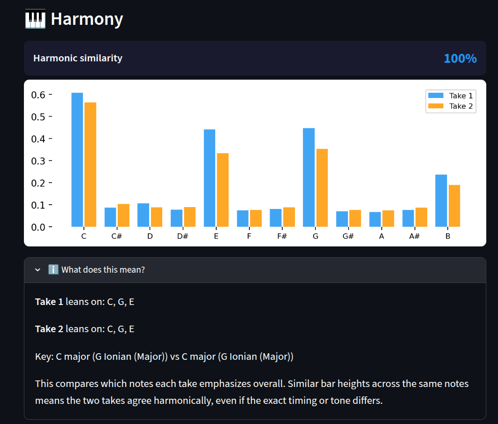

*Harmony card: pitch-class energy comparison bar chart (100% harmonic
similarity) with a plain-language explanation.*

## 7. Rhythm

  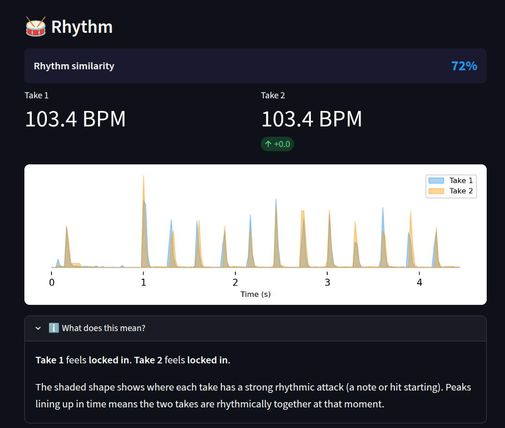

*Rhythm card: onset peak overlap graph (72% rhythm similarity) and a timing
lock-in verdict.*

## 8. Tone / Timbre

  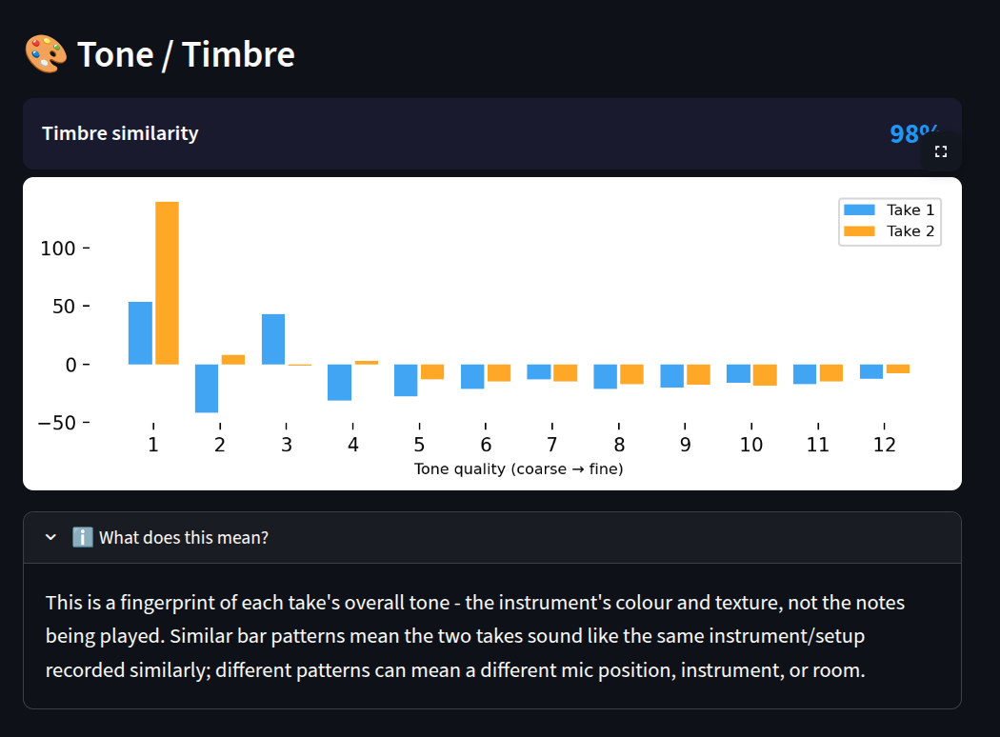

*Tone/Timbre card: coarse-to-fine spectral fingerprint bars (98% timbre
similarity), explaining instrument/mic color match.*

## 9. Dynamics

  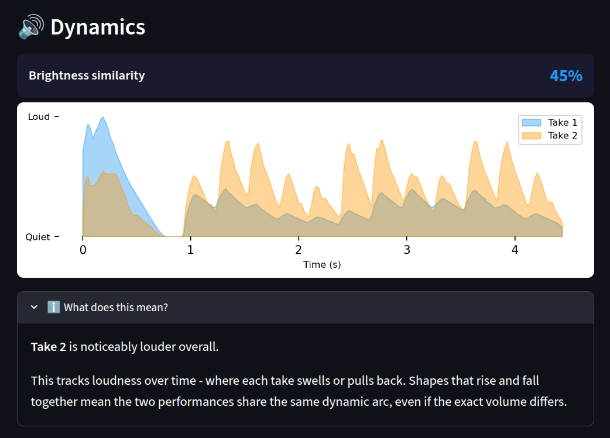

*Dynamics card: volume envelopes over time (45% similarity), highlighting
relative loudness swells between takes.*

---

## That's the whole app

Nine sections, all in plain language, all built from the exact same
analysis as the Full client. What's genuinely absent is the
research-grade view - no spectrograms, no DTW warping-path plots, no MDS
map, no Score/MIDI alignment tab - not because ESM can't handle them, but
because none of them answer what a band member walked in asking: *did
tonight's take match, and if not, where.*

Everything shown here is computed by the exact same FastAPI backend as the
Full client - see `README.md`'s [architecture](README.md#architecture)
section for how one backend serves both personas without duplicating any
analysis code.
